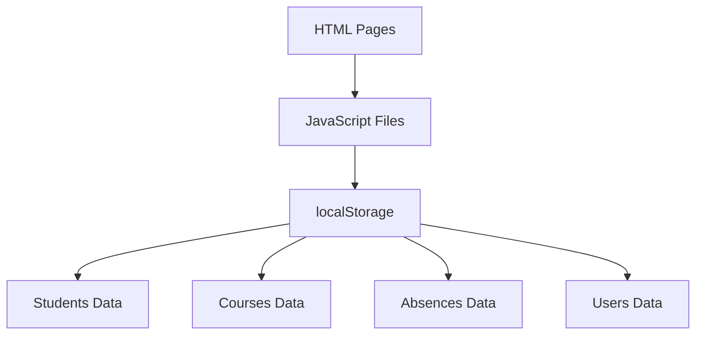
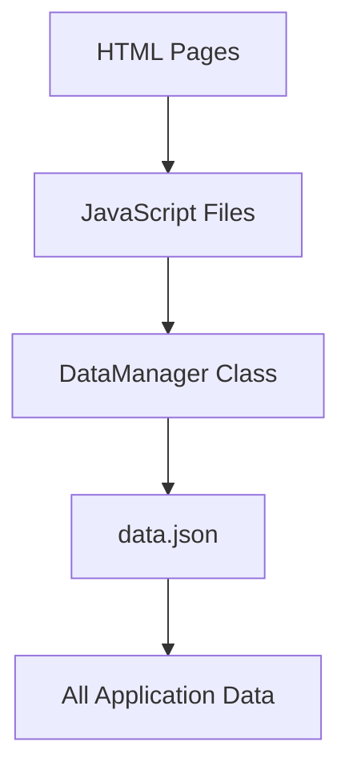

# Architecture Diagram

## Current Architecture (Using localStorage)

## New Architecture (Using JSON File)

## Benefits of New Architecture

1. **Centralized Data Storage**: All data is stored in a single JSON file
2. **Easier Management**: Data can be easily backed up or migrated
3. **Consistent Interface**: DataManager provides a consistent API for data operations
4. **Better Organization**: Clear separation between data management and business logic