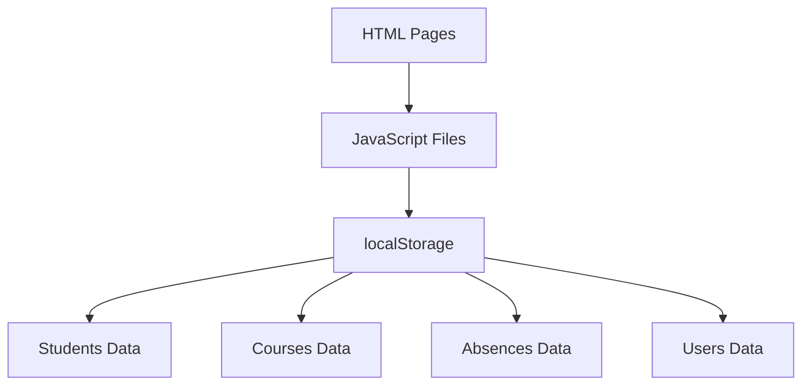
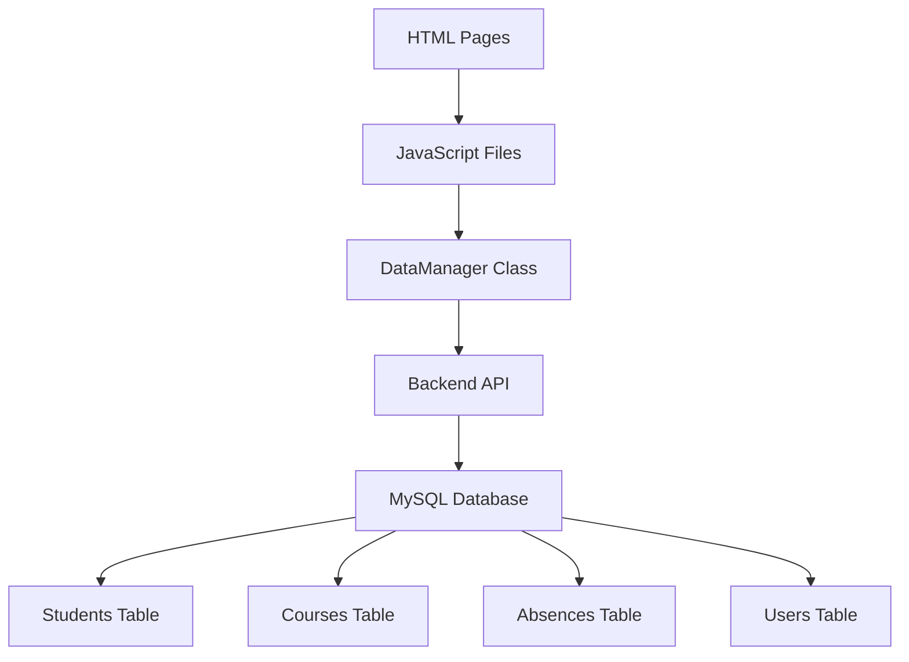

# Architecture Diagram

## Current Architecture (Using localStorage)

## New Architecture (Using MySQL Database with Backend API)

## Benefits of New Architecture

1. **Persistent Data Storage**: Data is stored in a MySQL database for persistence
2. **Scalability**: Database can handle larger amounts of data and concurrent users
3. **Data Integrity**: Database enforces data types and relationships
4. **Centralized Data Management**: All data is managed through the backend API
5. **Consistent Interface**: DataManager provides a consistent API for data operations
6. **Better Organization**: Clear separation between frontend, backend, and data storage